# MV3D_TF(In progress)

This is an experimental Tensorflow implementation of MV3D - a ConvNet for object detection with Lidar and Mono-camera.

For details about MV3D please refer to the paper [Multi-View 3D Object Detection Network for Autonomous Driving](https://arxiv.org/abs/1611.07759) by [Xiaozhi Chen](https://arxiv.org/find/cs/1/au:+Chen_X/0/1/0/all/0/1), [Huimin Ma](https://arxiv.org/find/cs/1/au:+Ma_H/0/1/0/all/0/1), [Ji Wan](https://arxiv.org/find/cs/1/au:+Wan_J/0/1/0/all/0/1), [Bo Li](https://arxiv.org/find/cs/1/au:+Li_B/0/1/0/all/0/1), [Tian Xia](https://arxiv.org/find/cs/1/au:+Xia_T/0/1/0/all/0/1).

### Requirements: software

1. Requirements for Tensorflow 1.0  (see: [Tensorflow](https://www.tensorflow.org/))

2. Python packages you might not have: `cython`, `python-opencv`, `easydict`

### Requirements: hardware

1. For training the end-to-end version of Faster R-CNN with VGG16, 3G of GPU memory is sufficient (using CUDNN)

### Installation 

1. Clone the Faster R-CNN repository
```Shell
  # Make sure to clone with --recursive
  git clone --recursive https://github.com/RyannnG/MV3D_TF.git
```

2. Build the Cython modules
   ```Shell
    cd $MV3D/lib
    make
   ```

3. Downloads KITTI object datasets.

```Shell
 % Specify KITTI data path so that the structure is like

 % {kitti_dir}/object/training/image_2
 %                            /image_3
 %                            /calib
 %                            /lidar_bv
 %							 /velodyne
       

 % {kitti_dir}/object/testing/image_2
 %                           /image_3
 %                           /calib
 %                           /lidar_bv
 %							/velodyne
```

4. Make Lidar Bird View data

   ```shell
   # edit the kitti_path in tools/read_lidar.py
   # then start make data
   python tools/read_lidar.py
   ```

5. Create symlinks for the KITTI dataset

```Shell
   cd $MV3D/data/KITTI
   ln -s {kitti_dir}/object object
```

5. Download pre-trained ImageNet models

   Download the pre-trained ImageNet models [[Google Drive]](https://drive.google.com/open?id=0ByuDEGFYmWsbNVF5eExySUtMZmM) [[Dropbox]](https://www.dropbox.com/s/po2kzdhdgl4ix55/VGG_imagenet.npy?dl=0)

```Shell
    mv VGG_imagenet.npy $MV3D/data/pretrain_model/VGG_imagenet.npy
```


6. Run script to train model 
```Shell
 cd $MV3D
 ./experiments/scripts/mv3d.sh $DEVICE $DEVICE_ID ${.npy/ckpt.meta} kitti_train
```
 DEVICE is either cpu/gpu

### Network Structure

Key idea: Use Lidar bird view to generate anchor boxes, then project those boxes on image to do classification.

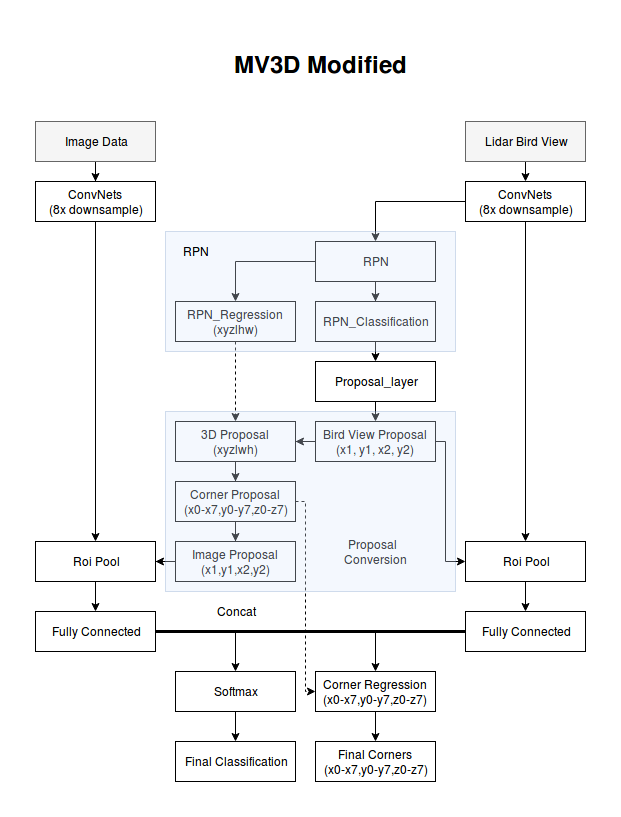

### Examples

Image and corresponding Lidar map 

**Note:**

In image:

+ Boxes  without regression

In Lidar:

+ white box: without regression (correspond with image)
+ purple box: with regression

1.

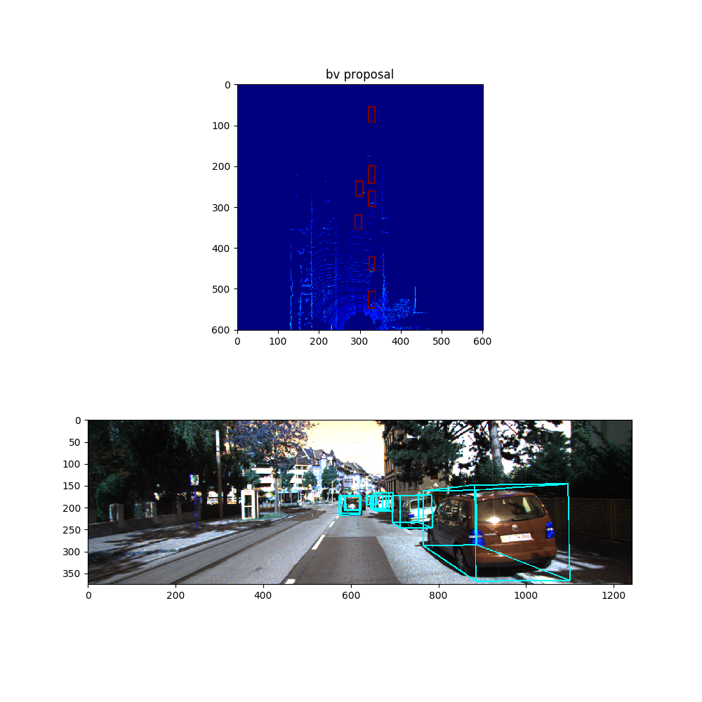

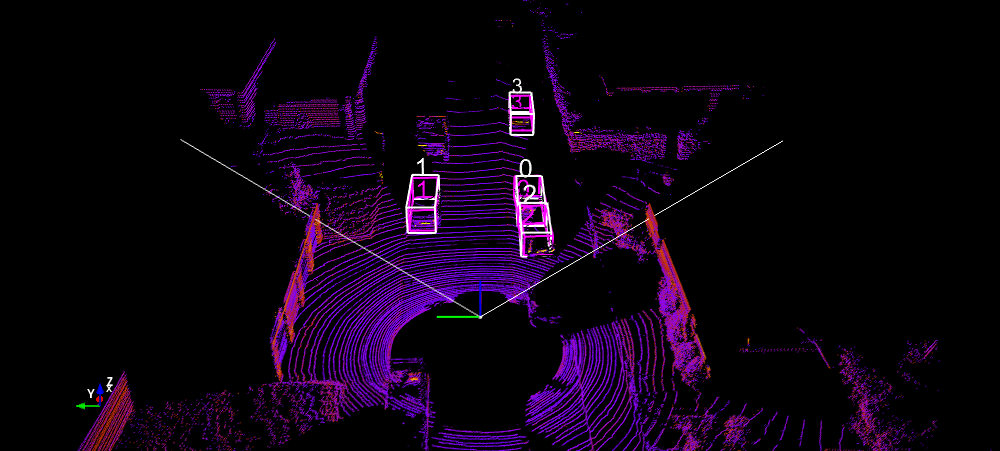

2.

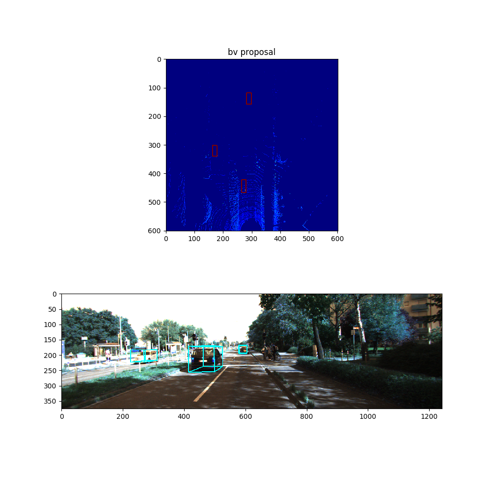

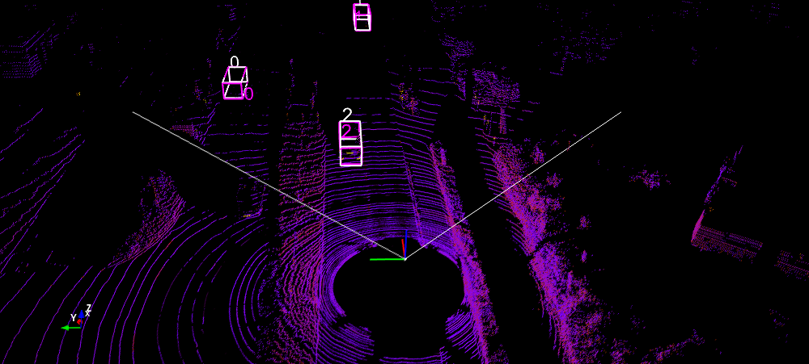

3. ​

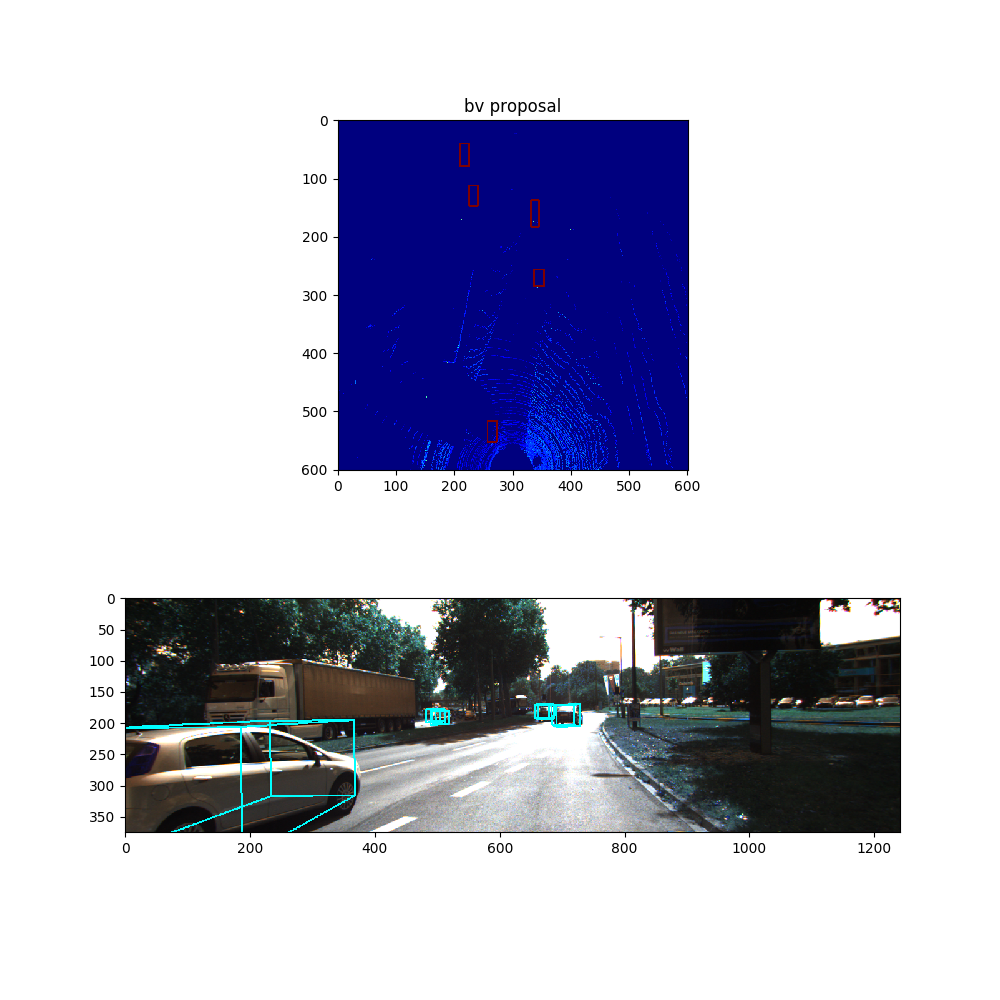


4.

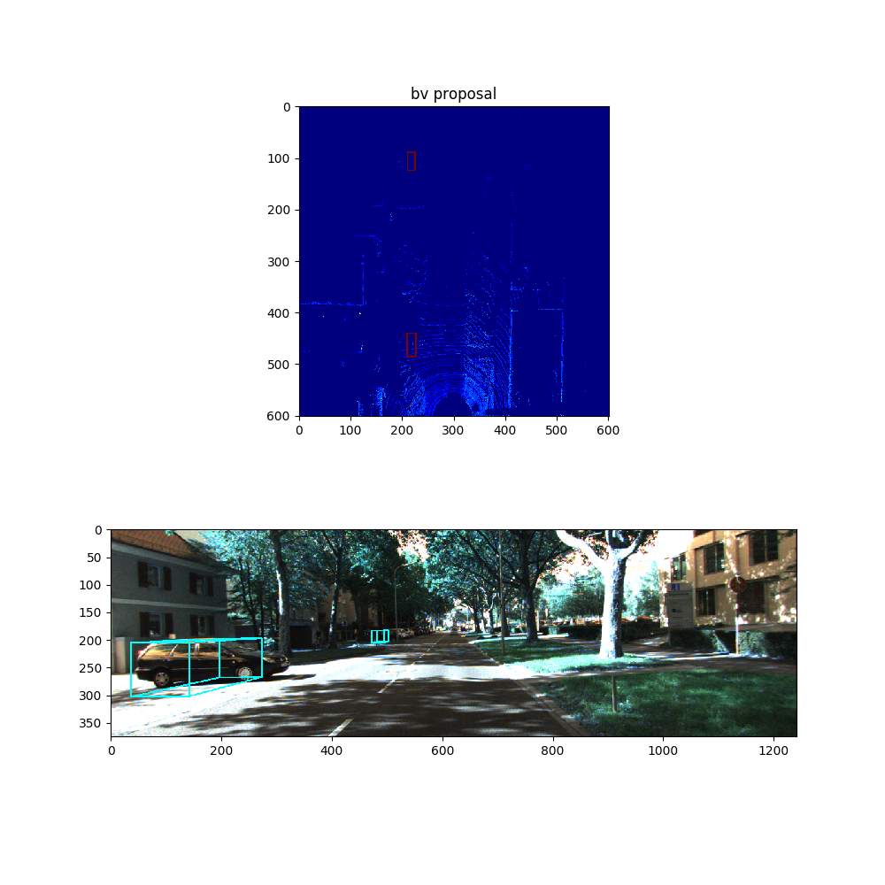

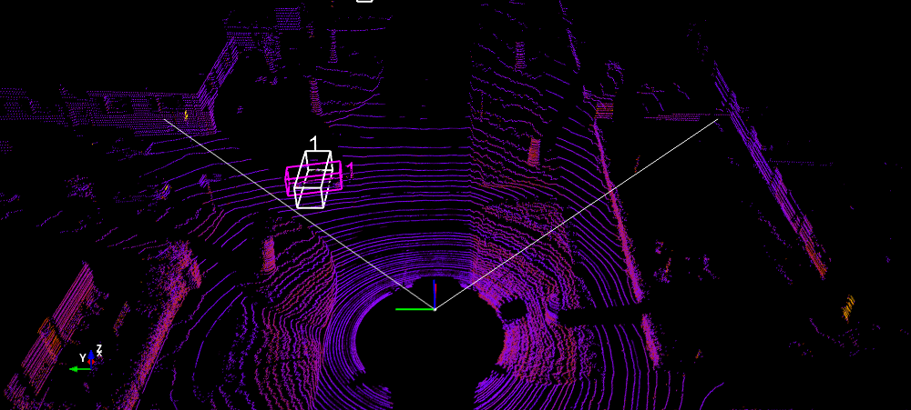

### Existing Errors

Mostly due to regression error

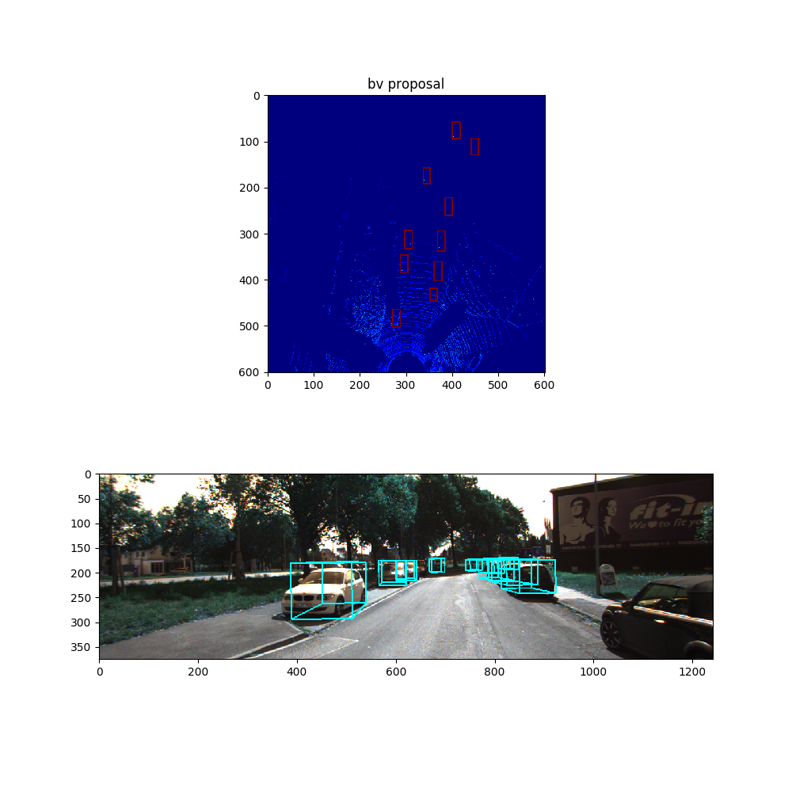

(error in box 5,6,9)


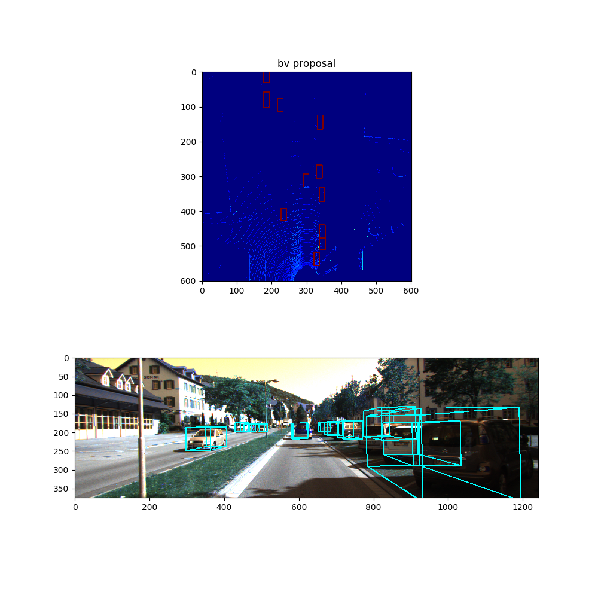

(error in 8, 9, 10)

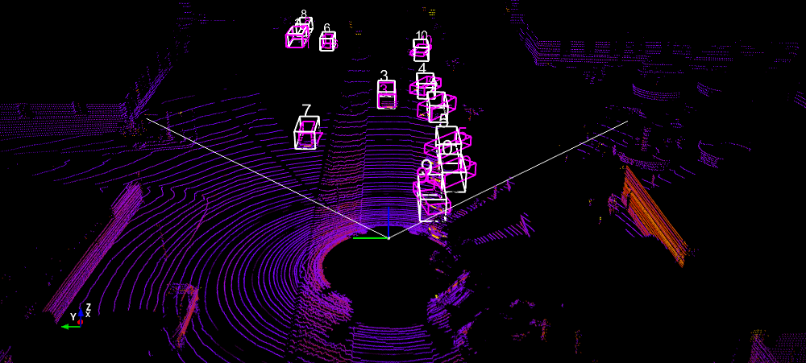

### References

[Lidar Birds Eye Views](http://ronny.rest/blog/post_2017_03_26_lidar_birds_eye/)

[part.2: Didi Udacity Challenge 2017 — Car and pedestrian Detection using Lidar and RGB](https://medium.com/@hengcherkeng/part-1-didi-udacity-challenge-2017-car-and-pedestrian-detection-using-lidar-and-rgb-fff616fc63e8)

[Faster_RCNN_TF](https://github.com/smallcorgi/Faster-RCNN_TF)

[Faster R-CNN caffe version](https://github.com/rbgirshick/py-faster-rcnn)

[TFFRCNN](https://github.com/CharlesShang/TFFRCNN)

